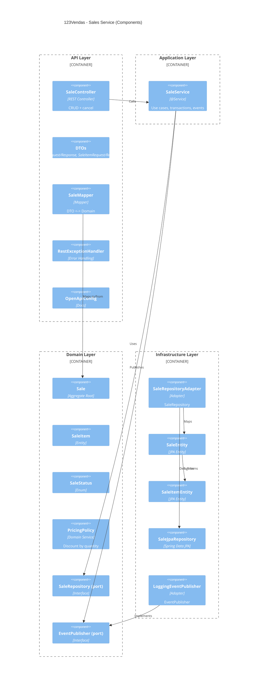

# C4 - Component Diagram (API/Service)

```mermaid
C4Component
    title 123Vendas - Sales Service (Components)

    Container_Boundary(api, "API Layer") {
        Component(ctrl, "SaleController", "REST Controller", "CRUD + cancel")
        Component(dto, "DTOs", "SaleRequest/Response, SaleItemRequest/Response")
        Component(mapper, "SaleMapper", "Mapper", "DTO <-> Domain")
        Component(exh, "RestExceptionHandler", "Error Handling")
        Component(openapi, "OpenApiConfig", "Docs")
    }

    Container_Boundary(app, "Application Layer") {
        Component(service, "SaleService", "@Service", "Use cases, transactions, events")
    }

    Container_Boundary(domain, "Domain Layer") {
        Component(aggregate, "Sale", "Aggregate Root")
        Component(item, "SaleItem", "Entity")
        Component(status, "SaleStatus", "Enum")
        Component(policy, "PricingPolicy", "Domain Service", "Discount by quantity")
        Component(portRepo, "SaleRepository (port)", "Interface")
        Component(portEvent, "EventPublisher (port)", "Interface")
    }

    Container_Boundary(infra, "Infrastructure Layer") {
        Component(adapterRepo, "SaleRepositoryAdapter", "Adapter", "SaleRepository")
        Component(entitySale, "SaleEntity", "JPA Entity")
        Component(entityItem, "SaleItemEntity", "JPA Entity")
        Component(jpa, "SaleJpaRepository", "Spring Data JPA")
        Component(adapterEvent, "LoggingEventPublisher", "Adapter", "EventPublisher")
    }

    Rel(ctrl, service, "Calls")
    Rel(mapper, aggregate, "Maps to/from")
    Rel(service, portRepo, "Uses")
    Rel(service, portEvent, "Publishes")
    Rel(adapterRepo, jpa, "Delegates")
    Rel(adapterRepo, entitySale, "Maps")
    Rel(entitySale, entityItem, "1..* Items")
    Rel(adapterEvent, portEvent, "Implements")
```
