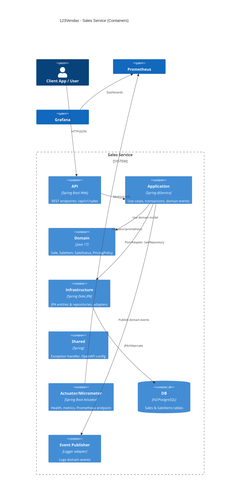

# C4 - Container Diagram

```mermaid
C4Container
    title 123Vendas - Sales Service (Containers)

    Person(customer, "Client App / User")

    System_Boundary(sales, "Sales Service") {
        Container(api, "API", "Spring Boot Web", "REST endpoints: /api/v1/sales")
        Container(app, "Application", "Spring @Service", "Use cases, transactions, domain events")
        Container(domain, "Domain", "Java 17", "Sale, SaleItem, SaleStatus, PricingPolicy")
        Container(infra, "Infrastructure", "Spring Data JPA", "JPA entities & repositories, adapters")
        Container(shared, "Shared", "Spring", "Exception handler, OpenAPI config")
        Container(metrics, "Actuator/Micrometer", "Spring Boot Actuator", "Health, metrics, Prometheus endpoint")
        ContainerDb(db, "DB", "H2/PostgreSQL", "Sales & SaleItems tables")
        Container(event, "Event Publisher", "Logger adapter", "Logs domain events")
    }

    System(prom, "Prometheus")
    System(graf, "Grafana")

    Rel(customer, api, "HTTP/JSON")
    Rel(api, app, "Method calls")
    Rel(app, domain, "Use domain model")
    Rel(app, infra, "Port/Adapter: SaleRepository")
    Rel(infra, db, "JPA/Hibernate")
    Rel(app, event, "Publish domain events")
    Rel(metrics, prom, "/actuator/prometheus")
    Rel(graf, prom, "Dashboards")
```
