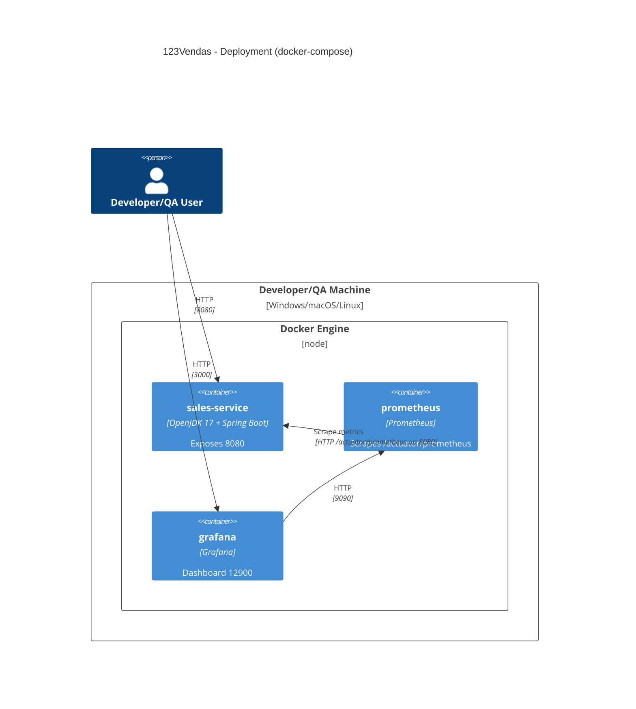

# C4 - Deployment Diagram

```mermaid
C4Deployment
    title 123Vendas - Deployment (docker-compose)

    Person(user, "Developer/QA User")

    Deployment_Node(workstation, "Developer/QA Machine", "Windows/macOS/Linux") {
        Deployment_Node(docker, "Docker Engine") {
            Container(app, "sales-service", "OpenJDK 17 + Spring Boot", "Exposes 8080")
            Container(prom, "prometheus", "Prometheus", "Scrapes /actuator/prometheus")
            Container(graf, "grafana", "Grafana", "Dashboard 12900")
        }
    }

    Rel(user, app, "HTTP", "8080")
    Rel(prom, app, "Scrape metrics", "HTTP /actuator/prometheus on 8080")
    Rel(graf, prom, "HTTP", "9090")
    Rel(user, graf, "HTTP", "3000")
```
