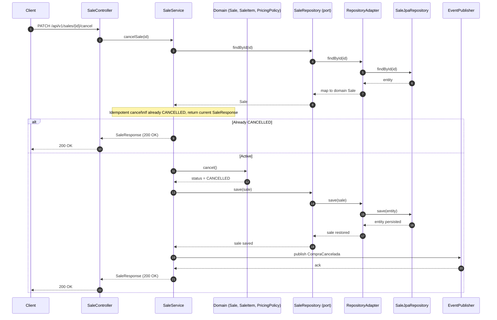

# Sequence Diagram - Cancel Sale

```mermaid
sequenceDiagram
    autonumber
    participant C as Client
    participant API as SaleController
    participant S as SaleService
    participant D as Domain (Sale, SaleItem, PricingPolicy)
    participant R as SaleRepository (port)
    participant A as RepositoryAdapter
    participant J as SaleJpaRepository
    participant E as EventPublisher

    C->>API: PATCH /api/v1/sales/{id}/cancel
    API->>S: cancelSale(id)
    S->>R: findById(id)
    R->>A: findById(id)
    A->>J: findById(id)
    J-->>A: entity
    A-->>R: map to domain Sale
    R-->>S: Sale

    Note over S: Idempotent cancel\nIf already CANCELLED, return current SaleResponse
    alt Already CANCELLED
        S-->>API: SaleResponse (200 OK)
        API-->>C: 200 OK
    else Active
        S->>D: cancel()
        D-->>S: status = CANCELLED

        S->>R: save(sale)
        R->>A: save(sale)
        A->>J: save(entity)
        J-->>A: entity persisted
        A-->>R: sale restored
        R-->>S: sale saved

        S->>E: publish CompraCancelada
        E-->>S: ack

        S-->>API: SaleResponse (200 OK)
        API-->>C: 200 OK
    end
```
