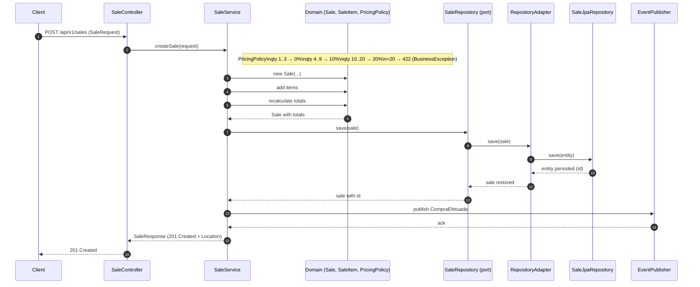

# Sequence Diagram - Create Sale

```mermaid
sequenceDiagram
    autonumber
    participant C as Client
    participant API as SaleController
    participant S as SaleService
    participant D as Domain (Sale, SaleItem, PricingPolicy)
    participant R as SaleRepository (port)
    participant A as RepositoryAdapter
    participant J as SaleJpaRepository
    participant E as EventPublisher

    C->>API: POST /api/v1/sales (SaleRequest)
    API->>S: createSale(request)
    Note over D: PricingPolicy\nqty 1..3 → 0%\nqty 4..9 → 10%\nqty 10..20 → 20%\n>20 → 422 (BusinessException)
    S->>D: new Sale(...)
    S->>D: add items
    S->>D: recalculate totals
    D-->>S: Sale with totals
    S->>R: save(sale)
    R->>A: save(sale)
    A->>J: save(entity)
    J-->>A: entity persisted (id)
    A-->>R: sale restored
    R-->>S: sale with id
    S->>E: publish CompraEfetuada
    E-->>S: ack
    S-->>API: SaleResponse (201 Created + Location)
    API-->>C: 201 Created
```
