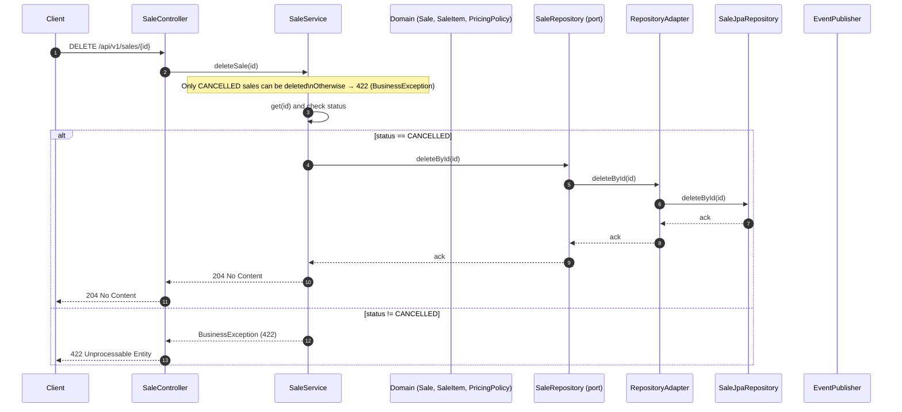

# Sequence Diagram - Delete Sale

```mermaid
sequenceDiagram
    autonumber
    participant C as Client
    participant API as SaleController
    participant S as SaleService
    participant D as Domain (Sale, SaleItem, PricingPolicy)
    participant R as SaleRepository (port)
    participant A as RepositoryAdapter
    participant J as SaleJpaRepository
    participant E as EventPublisher

    C->>API: DELETE /api/v1/sales/{id}
    API->>S: deleteSale(id)
    Note over S: Only CANCELLED sales can be deleted\nOtherwise → 422 (BusinessException)
    S->>S: get(id) and check status
    alt status == CANCELLED
        S->>R: deleteById(id)
        R->>A: deleteById(id)
        A->>J: deleteById(id)
        J-->>A: ack
        A-->>R: ack
        R-->>S: ack

        S-->>API: 204 No Content
        API-->>C: 204 No Content
    else status != CANCELLED
        S-->>API: BusinessException (422)
        API-->>C: 422 Unprocessable Entity
    end
```
