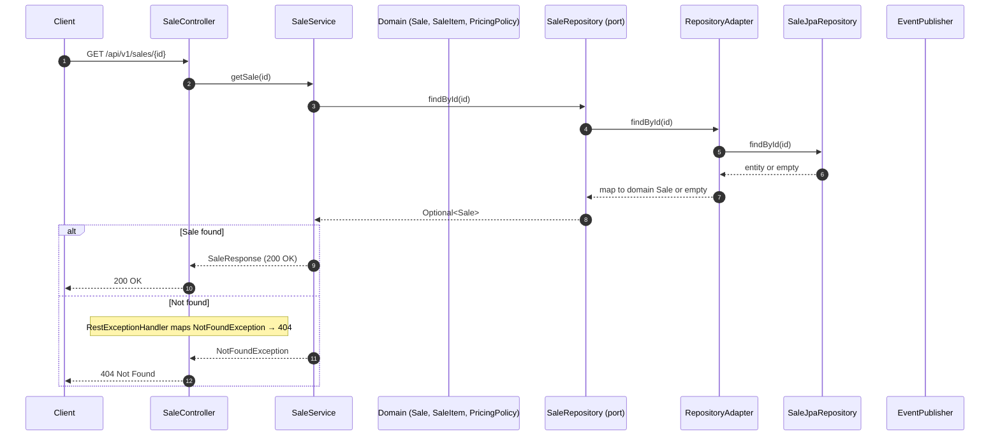

# Sequence Diagram - Get Sale

```mermaid
sequenceDiagram
    autonumber
    participant C as Client
    participant API as SaleController
    participant S as SaleService
    participant D as Domain (Sale, SaleItem, PricingPolicy)
    participant R as SaleRepository (port)
    participant A as RepositoryAdapter
    participant J as SaleJpaRepository
    participant E as EventPublisher

    C->>API: GET /api/v1/sales/{id}
    API->>S: getSale(id)
    S->>R: findById(id)
    R->>A: findById(id)
    A->>J: findById(id)
    J-->>A: entity or empty
    A-->>R: map to domain Sale or empty
    R-->>S: Optional<Sale>

    alt Sale found
        S-->>API: SaleResponse (200 OK)
        API-->>C: 200 OK
    else Not found
        Note over API: RestExceptionHandler maps NotFoundException → 404
        S-->>API: NotFoundException
        API-->>C: 404 Not Found
    end
```
