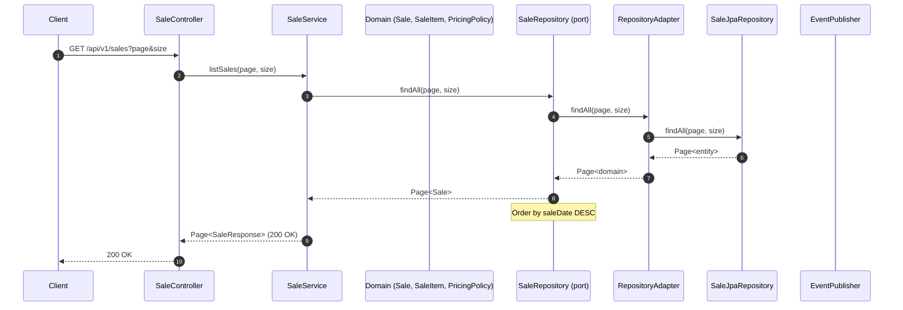

# Sequence Diagram - List Sales

```mermaid
sequenceDiagram
    autonumber
    participant C as Client
    participant API as SaleController
    participant S as SaleService
    participant D as Domain (Sale, SaleItem, PricingPolicy)
    participant R as SaleRepository (port)
    participant A as RepositoryAdapter
    participant J as SaleJpaRepository
    participant E as EventPublisher

    C->>API: GET /api/v1/sales?page&size
    API->>S: listSales(page, size)
    S->>R: findAll(page, size)
    R->>A: findAll(page, size)
    A->>J: findAll(page, size)
    J-->>A: Page<entity>
    A-->>R: Page<domain>
    R-->>S: Page<Sale>
    Note over R: Order by saleDate DESC
    S-->>API: Page<SaleResponse> (200 OK)
    API-->>C: 200 OK
```
