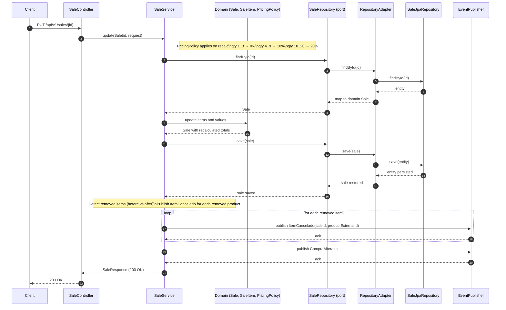

# Sequence Diagram - Update Sale

```mermaid
sequenceDiagram
    autonumber
    participant C as Client
    participant API as SaleController
    participant S as SaleService
    participant D as Domain (Sale, SaleItem, PricingPolicy)
    participant R as SaleRepository (port)
    participant A as RepositoryAdapter
    participant J as SaleJpaRepository
    participant E as EventPublisher

    C->>API: PUT /api/v1/sales/{id}
    API->>S: updateSale(id, request)
    Note over D: PricingPolicy applies on recalc\nqty 1..3 → 0%\nqty 4..9 → 10%\nqty 10..20 → 20%
    S->>R: findById(id)
    R->>A: findById(id)
    A->>J: findById(id)
    J-->>A: entity
    A-->>R: map to domain Sale
    R-->>S: Sale

    S->>D: update items and values
    D-->>S: Sale with recalculated totals

    S->>R: save(sale)
    R->>A: save(sale)
    A->>J: save(entity)
    J-->>A: entity persisted
    A-->>R: sale restored
    R-->>S: sale saved

    Note over S: Detect removed items (before vs after)\nPublish ItemCancelado for each removed product
    loop for each removed item
        S->>E: publish ItemCancelado(saleId, productExternalId)
        E-->>S: ack
    end

    S->>E: publish CompraAlterada
    E-->>S: ack

    S-->>API: SaleResponse (200 OK)
    API-->>C: 200 OK
```
